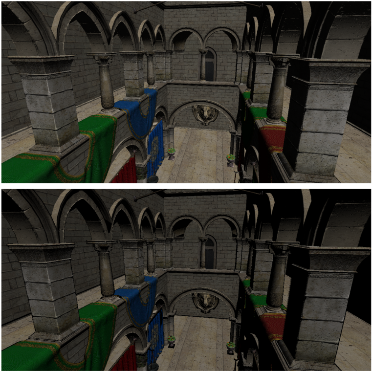

# BGFX PBR-Anime Shader Showcase



A 3D model viewer built with [big2-stack](https://github.com/Paper-Cranes-Ltd/big2-stack) (bgfx + GLFW + ImGui) and Assimp.
It showcases both a standard PBR render and an Anime style render on the loaded model.

## Requirements

### Tools
- **CMake** 3.10 or newer
- **Ninja** build system
- A C++20-capable compiler:
  - **Windows**: MSVC (Visual Studio 2019 or newer)

### Dependencies (fetched as Git submodules)
- [big2-stack](https://github.com/Paper-Cranes-Ltd/big2-stack) — bgfx, GLFW, GLM, ImGui, GSL
- [assimp](https://github.com/assimp/assimp) — 3D model loading
- stb — image loading

## Building

1. **Clone the repository with submodules**
   ```bash
   git clone --recurse-submodules https://github.com/jrcala7/Weeb_Big2.git
   cd Weeb_Big2
   ```
   If you already cloned without submodules, initialize them with:
   ```bash
   git submodule update --init --recursive
   ```

2. **Configure with CMake** (choose a preset from `CMakePresets.json`)

   | Preset | Platform | Config |
   |---|---|---|
   | `x64-debug` | Windows x64 | Debug |
   | `x64-release` | Windows x64 | Release |

   ```bash
   cmake --preset x64-release
   ```

3. **Build**
   ```bash
   cmake --build --preset x64-release
   ```

4. **Run** — the executable and the `resources/` folder will be placed in `out/build/<preset>/`:
   ```bash
   ./out/build/x64-release/Weeb_Big2
   ```

## Controls

| Key | Action |
|---|---|
| `W` | Move forward |
| `S` | Move backward |
| `A` | Strafe left |
| `D` | Strafe right |
| `Q` | Move down |
| `E` | Move up |
| `Left Shift` | Sprint (4× speed) |
| `↑` / `I` | Pitch camera up |
| `↓` / `K` | Pitch camera down |
| `←` / `J` | Yaw camera right |
| `→` / `L` | Yaw camera left |
